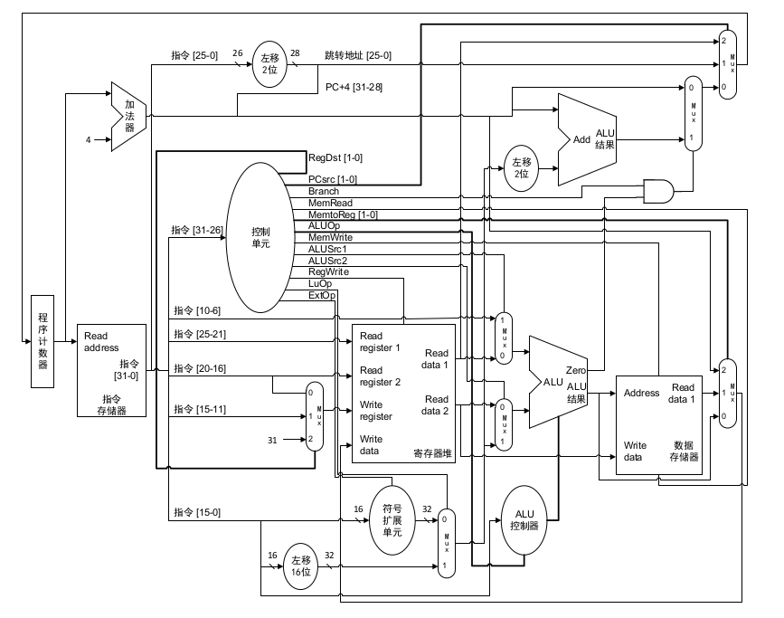
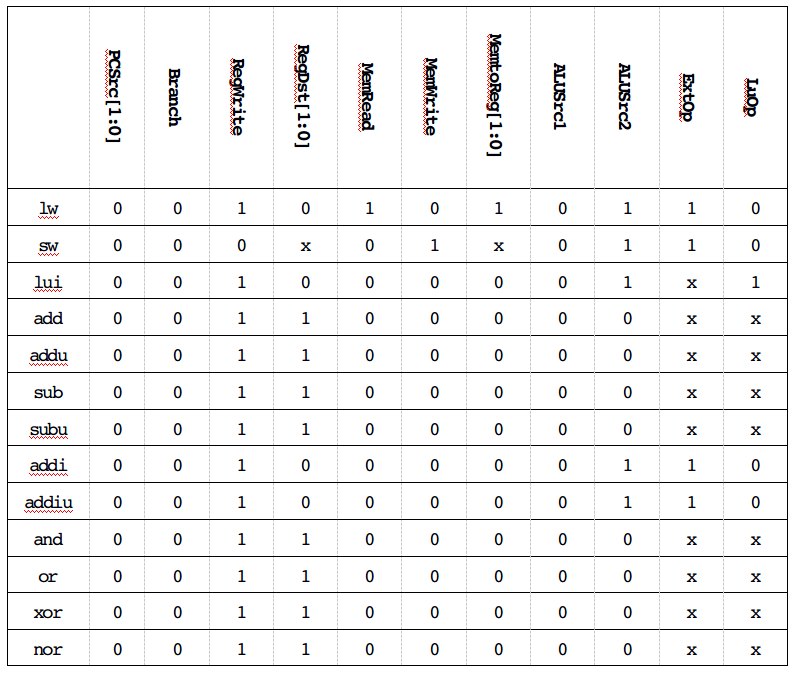
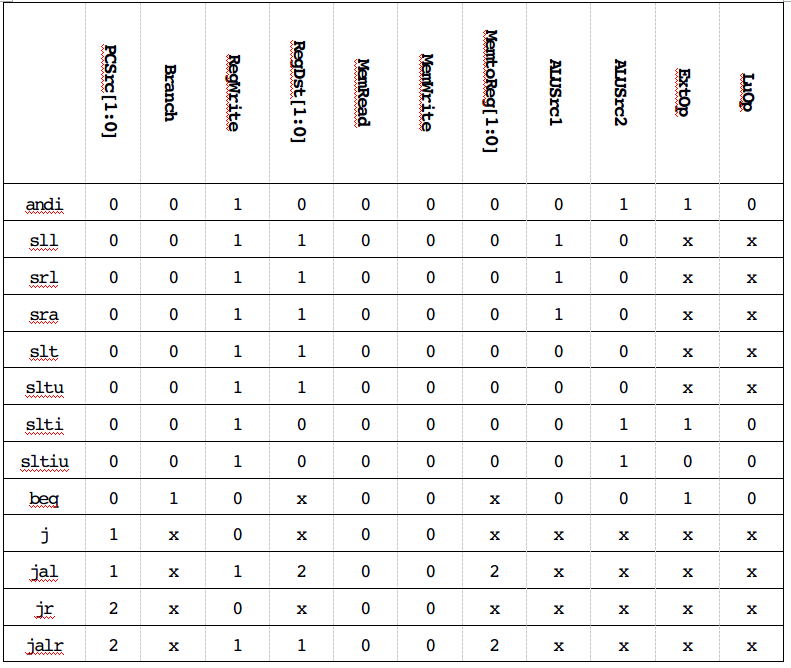

# 数字逻辑与处理器基础大作业

## 单周期处理器

### 设计要求

完成一个单周期处理的控制器部分。达到实现`MIPS`指令集的一个子集，包括：

```
lw, sw, lui
add, addu, sub, subu, addi, addiu
and, or, xor, nor, andi, sll, srl, sra, slt, sltu, sltiu
beq, j, jal, jr, jalr
```

### 处理器结构



1. 回答以下问题

    1. 由`RegDst`信号控制的多路选择器，输入2对应常数31。这里的31代表31号寄存器`$ra`，在执行以下跳转指令时`RegDst`信号会置为2，因为跳转指令需保存跳转前的地址，便于在执行完子过程后恢复至原来的位置。
        ```
        jal target
        ```
    
    2. 由`ALUSrc1`信号控制的多路选择器，输入1对应的指令`[10-6]`是移位运算的位移量，在执行以下三种移位指令时`ALUSrc1`信号会置为1，ALU从指令`[10-6]`段读取位移量再进行计算。
        ```
        sll rd, rt, shamt
        srl rd, rt, shamt
        sra rd, rt, shamt
        ```
    
    3. 由`MemtoReg`信号控制的多路选择器，输入2对应的是`PC+4`，执行以下跳转指令时`MemtoReg`信号会置为2，将`PC+4`存入寄存器便于以后恢复。
        ```
        jal target
        jalr rd, rs
        ```
    
    4. 图中的处理器结构并没有`Jump`控制信号，取而代之的是`PCSrc`信号。`PCSrc`信号控制的多路选择器，输入2对应的是从寄存器读取的地址，并赋给`PC`，执行以下两种寄存器跳转指令时`PCSrc`信号会置为2，跳转至寄存器中的地址。
        ```
        jr rs
        jalr rd, rs
        ```
    
    5. 利用`ExtOp`信号区分指令`[15:0]`是有符号型立即数（或地址偏移量）还是无符号型立即数。
        ```
        # ExtOp = 1
        lw rt, offset(rs)
        sw rt, offset(rs)
        addi rt, rs, imm
        addiu rt, rs, imm
        andi rt, rs, imm
        slti rt, rs, imm
        beq rs, rt, label
        
        # ExtOp = 0
        sltiu rt, rs, imm
        ```
        
    6. 指令全为0时，当前处理器结构下等价于
        ```
        sll $zero, $zero, 0
        ```
       即空指令功能，故无需更改处理器结构。
    
2. 根据对各控制信号功能的理解，得如下真值表






### 完成控制器

1. 阅读`CPU.v`，理解其实现方式。

    ```verilog
    
    module CPU(reset, clk);
	    input reset, clk;
	
	    reg [31:0] PC;
	    wire [31:0] PC_next;
	    always @(posedge reset or posedge clk)
		    if (reset)
			    PC <= 32'h00000000;
		    else
			    PC <= PC_next;
	
	    wire [31:0] PC_plus_4;
	    assign PC_plus_4 = PC + 32'd4;
	
	    wire [31:0] Instruction;
	    InstructionMemory instruction_memory1(.Address(PC), 
	                                          .Instruction(Instruction));
	
	    wire [1:0] RegDst;
	    wire [1:0] PCSrc;
	    wire Branch;
	    wire MemRead;
	    wire [1:0] MemtoReg;
	    wire [3:0] ALUOp;
	    wire ExtOp;
	    wire LuOp;
	    wire MemWrite;
	    wire ALUSrc1;
	    wire ALUSrc2;
	    wire RegWrite;
	
	    Control control1(
		    .OpCode(Instruction[31:26]), .Funct(Instruction[5:0]),
		    .PCSrc(PCSrc), .Branch(Branch), .RegWrite(RegWrite), .RegDst(RegDst), 
		    .MemRead(MemRead),	.MemWrite(MemWrite), .MemtoReg(MemtoReg),
		    .ALUSrc1(ALUSrc1), .ALUSrc2(ALUSrc2), .ExtOp(ExtOp), 
		    .LuOp(LuOp),	.ALUOp(ALUOp));
	
	    wire [31:0] Databus1, Databus2, Databus3;
	    wire [4:0] Write_register;
	    assign Write_register = (RegDst == 2'b00)? Instruction[20:16]: 
	                            (RegDst == 2'b01)? Instruction[15:11]: 5'b11111;
	    RegisterFile register_file1(.reset(reset), .clk(clk), .RegWrite(RegWrite), 
		    .Read_register1(Instruction[25:21]), 
		    .Read_register2(Instruction[20:16]), .Write_register(Write_register),
		    .Write_data(Databus3), .Read_data1(Databus1), .Read_data2(Databus2));
	
	    wire [31:0] Ext_out;
	    assign Ext_out = {ExtOp? {16{Instruction[15]}}: 
	                      16'h0000, Instruction[15:0]};
	
	    wire [31:0] LU_out;
	    assign LU_out = LuOp? {Instruction[15:0], 16'h0000}: Ext_out;
	
	    wire [4:0] ALUCtl;
	    wire Sign;
	    ALUControl alu_control1(.ALUOp(ALUOp), .Funct(Instruction[5:0]), 
	                            .ALUCtl(ALUCtl), .Sign(Sign));
	
	    wire [31:0] ALU_in1;
	    wire [31:0] ALU_in2;
	    wire [31:0] ALU_out;
	    wire Zero;
	    assign ALU_in1 = ALUSrc1? {17'h00000, Instruction[10:6]}: Databus1;
	    assign ALU_in2 = ALUSrc2? LU_out: Databus2;
	    ALU alu1(.in1(ALU_in1), .in2(ALU_in2), .ALUCtl(ALUCtl),
	             .Sign(Sign), .out(ALU_out), .zero(Zero));
	
	    wire [31:0] Read_data;
	    DataMemory data_memory1(.reset(reset), .clk(clk), .Address(ALU_out), 
	                            .Write_data(Databus2), .Read_data(Read_data), 
	                            .MemRead(MemRead), .MemWrite(MemWrite));
	    assign Databus3 = (MemtoReg == 2'b00)? ALU_out: 
	                      (MemtoReg == 2'b01)? Read_data: PC_plus_4;
	
	    wire [31:0] Jump_target;
	    assign Jump_target = {PC_plus_4[31:28], Instruction[25:0], 2'b00};
	
	    wire [31:0] Branch_target;
	    assign Branch_target = (Branch & Zero)? PC_plus_4 + {LU_out[29:0], 2'b00}: 
	                           PC_plus_4;
	
	    assign PC_next = (PCSrc == 2'b00)? Branch_target: 
	                     (PCSrc == 2'b01)? Jump_target: Databus1;

    endmodule
	
    ```
	
2. 完成`Control.v`

    ```verilog
        
    module Control(OpCode, Funct,
	    PCSrc, Branch, RegWrite, RegDst, 
	    MemRead, MemWrite, MemtoReg, 
	    ALUSrc1, ALUSrc2, ExtOp, LuOp, ALUOp);
	    input [5:0] OpCode;
	    input [5:0] Funct;
	    output [1:0] PCSrc;
	    output Branch;
	    output RegWrite;
	    output [1:0] RegDst;
	    output MemRead;
	    output MemWrite;
	    output [1:0] MemtoReg;
	    output ALUSrc1;
	    output ALUSrc2;
	    output ExtOp;
	    output LuOp;
	    output [3:0] ALUOp;
	
	    // Your code below

	    assign PCSrc = 
		    (OpCode == 6'h02 || OpCode == 6'h03)? 2'b01:
		    (OpCode == 6'h00 && (Funct == 6'h08 || Funct == 6'h09))? 2'b10:
		    2'b00;

	    assign Branch = (OpCode == 6'h04)? 1: 0;

	    assign RegWrite = 
		    (OpCode == 6'h2b || OpCode == 6'h04 || OpCode == 6'h02
			    || (OpCode == 6'h00 && Funct == 6'h08))? 0: 1;

	    assign RegDst = 
		    (OpCode == 6'h03)? 2'b10:
		    (OpCode == 6'h23 || OpCode == 6'h0f || OpCode == 6'h08
			    || OpCode == 6'h09 || OpCode == 6'h0c || OpCode == 6'h0a
			    || OpCode == 6'h0b)? 2'b01: 
		    2'b00;

	    assign MemRead = (OpCode == 6'h23)? 1: 0;

	    assign MemWrite = (OpCode == 6'h2b)? 1: 0;

	    assign MemtoReg = 
		    (OpCode == 6'h03 || (OpCode == 6'h00 && Funct == 6'h09))? 2'b10:
		    (OpCode == 6'h23)? 2'b01:
		    2'b00;

	    assign ALUSrc1 = 
		    (OpCode == 6'h00 && (Funct == 6'h00 || Funct == 6'h02 
			    || Funct == 6'h03))? 1: 0;

	    assign ALUSrc2 = 
		    (OpCode == 6'h23 || OpCode == 6'h2b || OpCode == 6'h0f
			    || OpCode == 6'h08 || OpCode == 6'h09 || OpCode == 6'h0c
			    || OpCode == 6'h0a || OpCode == 6'h0b)? 1: 0;

	    assign ExtOp = (OpCode == 6'h0b)? 0: 1;

	    assign LuOp = (OpCode == 6'h0f)? 1: 0;
	
	    // Your code above
	
	    assign ALUOp[2:0] = 
		    (OpCode == 6'h00)? 3'b010: 
		    (OpCode == 6'h04)? 3'b001: 
		    (OpCode == 6'h0c)? 3'b100: 
		    (OpCode == 6'h0a || OpCode == 6'h0b)? 3'b101: 
		    3'b000;
		
	    assign ALUOp[3] = OpCode[0];
	
    endmodule
    
    ```
    
3. 阅读`InstructionMemory.v`，根据注释理解指令存储器中的程序。

    ```verilog
        
    module InstructionMemory(Address, Instruction);
	    input [31:0] Address;
	    output reg [31:0] Instruction;
	
	    always @(*)
		    case (Address[9:2])
			    // addi $a0, $zero, 12345 #(0x3039)
			    8'd0:    Instruction <= {6'h08, 5'd0 , 5'd4 , 16'h3039};
			    // addiu $a1, $zero, -11215 #(0xd431)
			    8'd1:    Instruction <= {6'h09, 5'd0 , 5'd5 , 16'hd431};
			    // sll $a2, $a1, 16
			    8'd2:    Instruction <= {6'h00, 5'd0 , 5'd5 , 5'd6 , 5'd16 , 6'h00};
			    // sra $a3, $a2, 16
			    8'd3:    Instruction <= {6'h00, 5'd0 , 5'd6 , 5'd7 , 5'd16 , 6'h03};
			    // beq $a3, $a1, L1
			    8'd4:    Instruction <= {6'h04, 5'd7 , 5'd5 , 16'h0001};
			    // lui $a0, -11111 #(0xd499)
			    8'd5:    Instruction <= {6'h0f, 5'd0 , 5'd4 , 16'hd499};
			    // L1:
			    // add $t0, $a2, $a0
			    8'd6:    Instruction <= {6'h00, 5'd6 , 5'd4 , 5'd8 , 5'd0 , 6'h20};
			    // sra $t1, $t0, 8
			    8'd7:    Instruction <= {6'h00, 5'd0 , 5'd8 , 5'd9 , 5'd8 , 6'h03};
			    // addi $t2, $zero, -12345 #(0xcfc7)
			    8'd8:    Instruction <= {6'h08, 5'd0 , 5'd10, 16'hcfc7};
			    // slt $v0, $a0, $t2
			    8'd9:    Instruction <= {6'h00, 5'd4 , 5'd10 , 5'd2 , 5'd0 , 6'h2a};
			    // sltu $v1, $a0, $t2
			    8'd10:   Instruction <= {6'h00, 5'd4 , 5'd10 , 5'd3 , 5'd0 , 6'h2b};
			    // Loop:
			    // j Loop
			    8'd11:   Instruction <= {6'h02, 26'd11};
			
			    default: Instruction <= 32'h00000000;
		    endcase
		
    endmodule
    
    ```
    
    + *MIPS Assembly*
    
    ```
        addi $a0, $zero, 12345
        addiu $a1, $zero, -11215
        sll $a2, $a1, 16
        sra $a3, $a2, 16
        beq $a3, $a1, L1
        lui $a0, -11111
    L1:
        add $t0, $a2, $a0
        sra $t1, $t0, 8
        addi $t2, $zero, -12345
        slt $v0, $a0, $t2
        sltu $v1, $a0, $t2
    Loop:
        j Loop
    ```
    
    + 这段程序执行足够长时间后会陷入**死循环**，保持程序不结束。
    
    + 此时各寄存器的值为
    
        |寄存器|值|备注|
        |:----:|:----:|:------|
        |$a0|0x00003039|0: a0 = 0x0 + 0x3039|
        |$a1|0xffffd431|1: a1 = 0x0 + 0xffffd431(按符号位扩展，不抛出溢出异常)|
        |$a2|0xd4310000|2: a2 = a1 << 16|
        |$a3|0xffffd431|3: a3 = a2 >> 16(高位补符号位)|
        |/|/|4: jump to L1 if (a1 == a3)|
        |$t0|0xd4313039|6: t0 = a2 + a0|
        |$t1|0xffd43130|7: t1 = t0 >> 8(高位补符号位)|
        |$t2|0xffffcfc7|8: t2 = 0x0 + 0xffffcfc7|
        |$v0|0x00000000|9: v0 = (a0(12345) < t2(-12345)) ? 1 : 0|
        |$v1|0x00000001|10: v1 = (a0(12345) < t2(4294954951)) ? 1 : 0|
    
    + 已知某一时刻在某寄存器中存放着数`0xffffcfc7`，无法判断出它是有符号数还是无符号数。因为除了符号扩展可以产生形如`0xffffcfc7`这样的有符号数数外，利用`lui`和`addi`等操作也可以产生这样的无符号数，故无法单纯地由寄存器的值判断它是有符号数还是无符号数，必须结合具体的指令控制信号。
    
    
### 执行汇编程序

```
    addi $a0, $zero, 3 	    # a0 = 0 + 3
    jal sum			        # jump to Label: 'sum'
Loop:
    beq $zero, $zero, Loop	# if (0 == 0) jump to Label: 'Loop'
sum:
    addi $sp, $sp, -8		# sp -= 8
    sw $ra, 4($sp)			# sp[1] = ra
    sw $a0, 0($sp)			# sp[0] = a0
    slti $t0, $a0, 1		# t0 = (a0 < 1) ? 1 : 0
    beq $t0, $zero, L1		# if (t0 == 0) jump to Label: 'L1'
    xor $v0, $zero, $zero	# v0 = 0 ^ 0 = 0
    addi $sp, $sp, 8		# sp += 8
    jr $ra					# jump to Register: $ra
L1:
    addi $a0, $a0, -1		# a0 -= 1
    jal sum				    # jump and link Label: 'sum'
    lw $a0, 0($sp)			# a0 = sp[0]
    lw $ra, 4($sp)			# ra = sp[1]
    addi $sp, $sp, 8		# sp += 8
    add $v0, $a0, $v0		# v0 += a0
    jr $ra					# jump to Register: $ra
```

1. 该汇编程序的功能等价于以下`C++`程序

    ```cpp
    int sum(int n){
        if (n < 1)
            return 0;
        else
            return n + sum(n-1);
    }
    
    int main(void){
        int n = 3;
        sum(n);
        while (1)
            ;
        return 0;
    }
    ```
   
   + 即实现了求`1+2+...+n`的功能(并保持程序不终止)。
   
   + `Loop`死循环保持程序不终止。
   
   + `sum`计算边界条件(n==0)下的返回值，保存`$ra`,`$a0`，非边界条件跳转到`L1`。
   
   + `L1`调用子过程`sum(n-1)`，调用完毕，返回`n+sum(n-1)`。
   
2. 汇编程序->机器码

    + *指令存储器*
    
        |地址|指令|
        |:---|:---|
        |0x00400000|addi $a0, $zero, 3|
        |0x00400004|jal sum|
        |0x00400008|beq $zero, $zero, Loop|
        |0x0040000c|addi $sp, $sp, -8|
        |0x00400010|sw $ra, 4($sp)|
        |0x00400014|sw $a0, 0($sp)|
        |0x00400018|slti $t0, $a0, 1|
        |0x0040001c|beq $t0, $zero, L1|
        |0x00400020|xor $v0, $zero, $zero|
        |0x00400024|addi $sp, $sp, 8|
        |0x00400028|jr $ra|
        |0x0040002c|addi $a0, $a0, -1|
        |0x00400030|jal sum|
        |0x00400034|lw $a0, 0($sp)|
        |0x00400048|lw $ra, 4($sp)|
        |0x0040004c|addi $sp, $sp, 8|
        |0x00400050|add $v0, $a0, $v0|
        |0x00400054|jr $ra|
        
    + *机器码*
    
        ```
        
    
    
    
    
